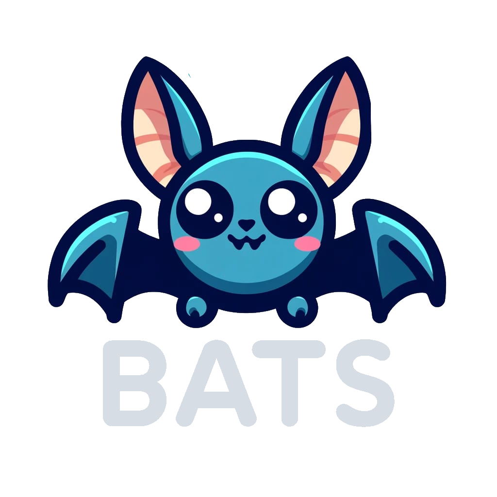

  

<h1 align="center"> Binary Arithmetic Teaching System </h1>

  

 <a href="">Video Demo</a> - <a href="">Live Demo </a> 

# Introduction

You don't know how do deal with binary numbers? No worries, BATS will help you! BATS provides theoretical information as well as automatically generated and evaluated exercises in order to help you learn binary conversion, decimal conversion, bianry arithmetic and logical operators.

# Installation

This project was done with [Angular CLI](https://github.com/angular/angular-cli) version 18.0.2 as well express.js.

If you want to install a local version of BATS, make sure to first install Angular 18.0.2 as well as express.js.

Then you can install the frontend by running the command-line command `npm install` in the root folder of BATS.

After running the command in the root folder, change to the backend folder and run `npm install` again.

Last step is to put the .env file with the needed password keys in the backend folder.
We will provide the professor with an .env file.

## Start the app

Run `ng serve` in the root folder of BATS in order to start the frontend.

Now open another terminal, change into the backend folder and run `nodemon server.js`.

Afterward you can open `http://localhost:4200/` and use BATS locally.
